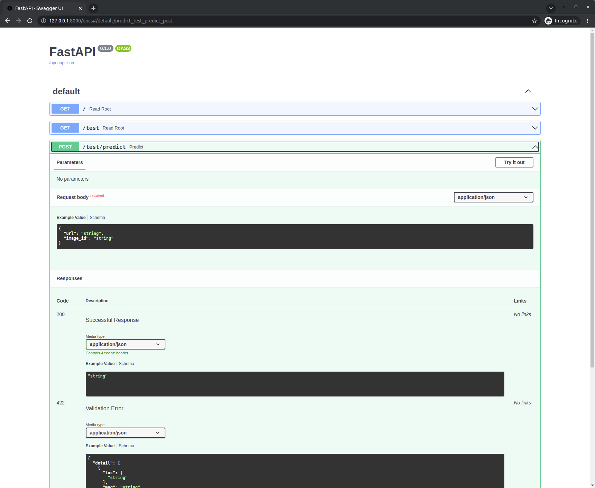

# ARV Hackathon 2021 Subsea Machine Learning

# Example Submission

## 1. API Requirements

In the deployment stage, you will get the URL of the image that you have to download, together with the `image_id` of the image (but we will *probably* remove `image_id` from the payload in the future).

After you download the image from the given URL, you can feed the image to your machine learning model, or run your other algorithms.

Once your machine learning model finished the prediction, return the (bounding box) results, following the structure that we describe below.

### Example payload:

```javascript
{"url":"https://rovula.com/image.png","image_id":1}
```

### Example cURL:

```javascript
curl -X POST \
  http://localhost/env/predict \
  -H 'accept: application/json' \
  -H 'content-type: application/json' \
  -d '{"url":"https://rovula.com/image.png","image_id":1}'
```

### Example Response:

```javascript
{
    "image_id" : 1,
    "bbox_list": [{
        "category_id": 1,
        "bbox": {
          "x": 0,
          "y": 220.66666666666669,
          "w": 1050.0986882341442,
          "h": 525.3333333333333
          },
        "score": 0.63508011493555
      }]
};
```

## 2. Usage

Clone the repository:

```bash
git clone https://github.com/Rovula/hackathon-fastapi.git
```

First, go into the project folder and install the dependencies:

```bash
pip install -r requirements.txt
```

For **local testing**, you have to change the [`path`](https://github.com/Rovula/hackathon-fastapi/blob/master/app/main.py#L10) variable. For example:

```python
# print(os.environ)
# path = config('path')
# TODO: For local testing, comment out the above lines and uncomment the below line.
path = 'test'
```

Then run the below command:

```bash
uvicorn app.main:app
```

Go to http://127.0.0.1:8000 in the browser. Go to http://127.0.0.1:8000/docs to see the example.





## 3. Submission Process

## References
