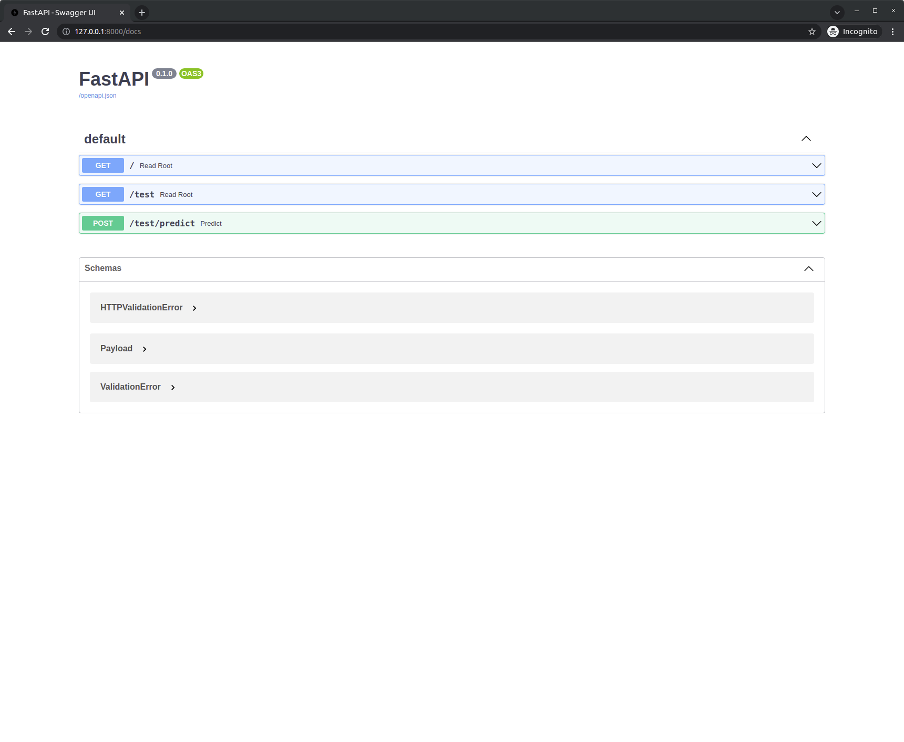

# ARV Hackathon 2021 Subsea Machine Learning

# Example Submission

## 1. API Requirements

In the deployment stage, you will get the URL of the image that you have to download, together with the `image_id` of the image (but we will *probably* remove `image_id` from the payload in the future).

After you download the image from the given URL, you can feed the image to your machine learning model, or run your other algorithms.

Once your machine learning model finished the prediction, return the (bounding box) results, following the structure that we describe below.

### Example payload:

```javascript
{"url":"https://rovula.com/image.png","image_id":1}
```

### Example cURL:

```javascript
curl -X POST \
  http://localhost/env/predict \
  -H 'accept: application/json' \
  -H 'content-type: application/json' \
  -d '{"url":"https://rovula.com/image.png","image_id":1}'
```

### Example Response:

```javascript
{
    "image_id" : 1,
    "bbox_list": [{
        "category_id": 1,
        "bbox": {
          "x": 0,
          "y": 220.66666666666669,
          "w": 1050.0986882341442,
          "h": 525.3333333333333
          },
        "score": 0.63508011493555
      }]
};
```

## 2. Usage

Clone the repository:

```bash
git clone https://github.com/Rovula/hackathon-fastapi.git
```

First, go into the project folder and install the dependencies:

```bash
pip install -r requirements.txt
```

For **local testing**, you have to change the [`path`](https://github.com/Rovula/hackathon-fastapi/blob/master/app/main.py#L10) variable. For example:

```python
# print(os.environ)
# path = config('path')
# TODO: For local testing, comment out the above lines and uncomment the below line.
path = 'test'
```

Then run the below command:

```bash
uvicorn app.main:app
```

Go to http://127.0.0.1:8000 in the browser. Go to http://127.0.0.1:8000/docs to see the example.




## 3. Build Local Docker Image for Local Testing

**Important**: Please build local Docker image and test it on your local PC before you submit!

### 3.1 Docker Login


### 3.2 Build local Docker image

To build a local Docker image **for local testing**, you have to change the [`path`](https://github.com/Rovula/hackathon-fastapi/blob/master/app/main.py#L10) variable as described in [section 2](#2-usage).

First go into the project folder where the `Dockerfile` exists.

Now, we will build the image and give the *name* to our image. The *name* will be the `repository_url` that we sent to each team via email.

```bash
docker build -t repository_url .
```

**Note**
- In some installation, you may have to use `sudo docker` instead of just `docker`.
- You may have to put double quote `""` around the `repository_url`.

### 3.3 Test your local Docker image

Once you build the local image, you can test with the following command.

```bash
docker run --rm -p 8000:8000 repository_url
```

Now, head to http://0.0.0.0:8000 or http://0.0.0.0:8000/docs to test your implementation.

## 4. Build Docker Image for Submission

### 4.1 AWS Configure

### 4.2 Docker Login

### 4.3 Build Docker Image

### 4.4 Push Docker Image

## References
